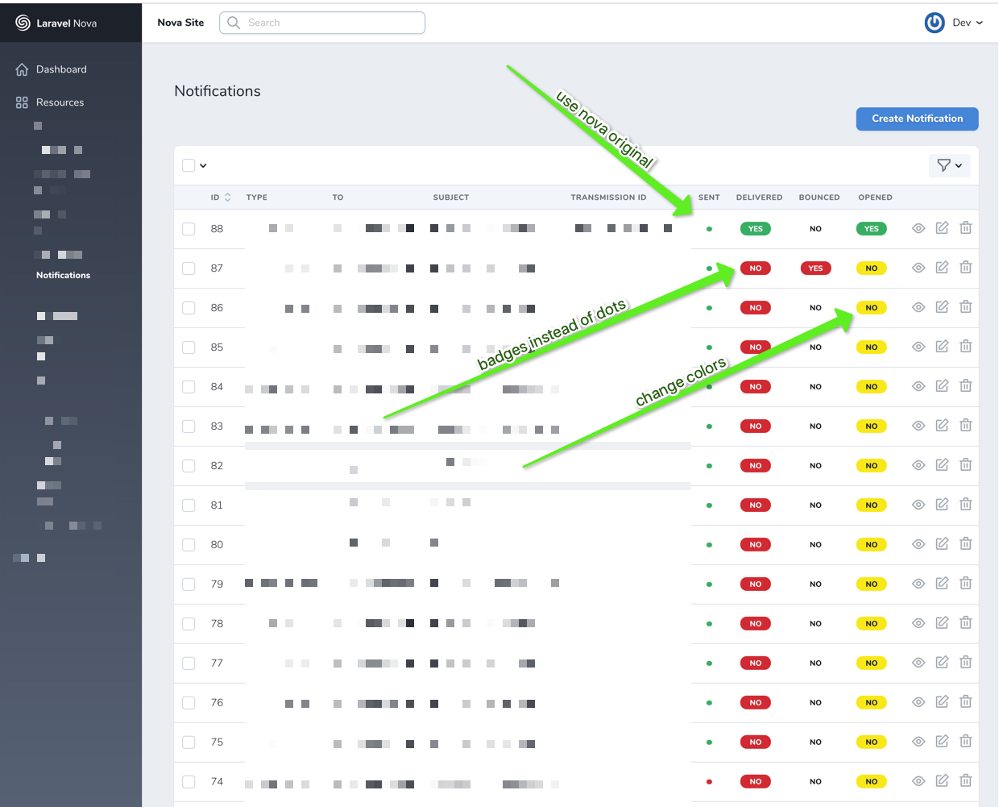
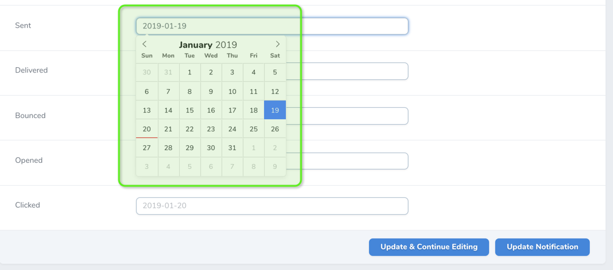
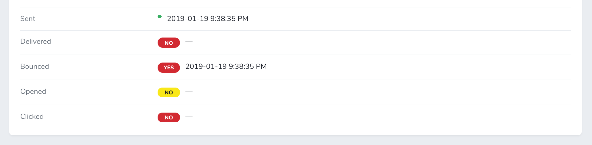

# Laravel Nova Boolean DateTime Field

This package allows you to show set/unset states for your date fields as boolean view or badges.

This is how your boolean dates will render:



Edit view will let you use the DatePicker as always



Detail view will show badges and values



### Installation Instructions

Install via [Composer](https://getcomposer.org/):

`$ composer require pragmarx/nova-boolean-datetime-field`

No you just have to use it in your Resources:

``` php
use PragmaRX\BooleanDatetime\BooleanDatetime;
```

And here's some usage examples:

``` php
BooleanDatetime::make('Sent', 'sent_at'),

BooleanDateTime::make('Delivered', 'delivered_at')
    ->badge(),

BooleanDateTime::make('Bounced', 'bounced_at')
    ->badge()
    ->colors('bg-danger text-white', 'bg-lighter text-black'),

BooleanDateTime::make('Opened', 'opened_at')
    ->badge()
    ->colors('bg-success text-white', 'bg-warning text-black'),

BooleanDateTime::make('Clicked', 'clicked_at')
    ->badge()
    ->hideFromIndex(),
```
